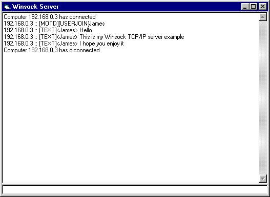



## Multi\-User TCP/IP WinSock Server Example /w max user limit & broadcast function\.

### Description

A mutli-user tcp/ip winsock server that features a max user limit & broadcast function.
 
### More Info
 
Please note when making a client for this the server broadcasts whatever it recieves.

             |
---                |---
**Submitted On**   |2003-03-14 18:21:14
**By**             |[Jimmy Kelly](https://github.com/Planet-Source-Code/PSCIndex/blob/master/ByAuthor/jimmy-kelly.md)
**Level**          |Intermediate
**User Rating**    |4.0 (20 globes from 5 users)
**Compatibility**  |VB 6\.0
**Category**       |[Internet/ HTML](https://github.com/Planet-Source-Code/PSCIndex/blob/master/ByCategory/internet-html__1-34.md)
**World**          |[Visual Basic](https://github.com/Planet-Source-Code/PSCIndex/blob/master/ByWorld/visual-basic.md)
**Archive File**   |[Multi\-User1559383142003\.zip](https://github.com/Planet-Source-Code/jimmy-kelly-multi-user-tcp-ip-winsock-server-example-w-max-user-limit-broadcast-function__1-44011/archive/master.zip)

